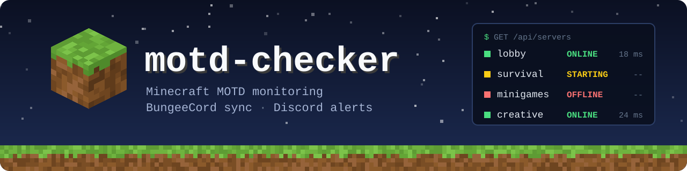

<p align="center">
  
</p>

<p align="center">
  <a href="https://github.com/Macaron27/motd-checker/actions/workflows/ci.yml"></a>
  <a href="https://github.com/Macaron27/motd-checker"></a>
  <a href="https://github.com/Macaron27/motd-checker/pkgs/container/motd-checker"></a>
  <a href="https://github.com/Macaron27/motd-checker/commits/main"></a>
  <a href="LICENSE"></a>
  <br>
  <a href="https://github.com/SpigotMC/BungeeCord"></a>
  <a href="https://discord.js.org/"></a>
</p>

# motd-checker

motd-checker is a lightweight Node.js application that monitors the Message of the Day (MOTD) of Minecraft servers registered through BungeeCord. It automatically checks for updates and can trigger notifications or database updates when the MOTD changes. It integrates with the BungeeServerManager plugin to dynamically update server availability in BungeeCord.

## Features

- Detects changes in the MOTD of Minecraft servers
- Integrates with BungeeServerManager to propagate updates
- Uses an SQL database to store server availability
- Configurable polling interval and target servers
- Optional Discord notifications (enabled with `--discord` flag)
- Web API for status checking
- Keeps a snapshot of the previous MOTD for accurate comparisons
- Multi-arch Docker image (`linux/amd64`, `linux/arm64`)

## Why It's Useful

- Detect MOTD changes to enable/disable servers on BungeeCord
- Detect outages in infrastructure and prevent access to disabled servers, reducing user confusion

## Requirements

- Node.js 22 or newer, **or** Docker
- MySQL database
- BungeeCord with BungeeServerManager plugin

## Installation

1. Clone the repository:
   ```bash
   git clone https://github.com/Macaron27/motd-checker.git
   cd motd-checker
   ```

2. Install dependencies:
   ```bash
   npm ci
   ```

3. Create your `.env` from the template and fill it in (never commit it, it is git-ignored):
   ```bash
   cp .env.example .env
   ```

   ```env
   # Database
   DB_HOST=your_db_host
   DB_USER=your_db_user
   DB_PASSWORD=your_db_password
   DB_NAME=your_db_name

   # Optional: Web server
   ENABLE_WEB=1
   PORT=3000

   # Optional: Refresh interval (ms)
   REFRESH_INTERVAL=15000

   # Optional: Minecraft timeout (ms)
   MINECRAFT_TIMEOUT=10000

   # Optional: Discord notifications
   DISCORD_BOT_TOKEN=your_bot_token
   DISCORD_GUILD_ID=your_guild_id
   DISCORD_CHANNEL_ID=your_channel_id
   ```

## Usage

Run the checker:
```bash
npm start
```

To enable Discord notifications:
```bash
node server.js --discord
```

The application will start monitoring the servers and update the database accordingly. If Discord is enabled, it will send notifications on status changes.

## Docker

A multi-arch image (`linux/amd64`, `linux/arm64`) is published to GitHub Container Registry on every push to `main`:

```bash
docker run -d --name motd-checker --env-file .env -p 3000:3000 ghcr.io/macaron27/motd-checker:latest
```

Arguments after the image name are passed to the app, e.g. to enable Discord notifications:

```bash
docker run -d --name motd-checker --env-file .env -p 3000:3000 ghcr.io/macaron27/motd-checker:latest --discord
```

> [!NOTE]
> Inside a container, `localhost` is the container itself. If MySQL runs on the Docker host, set `DB_HOST=host.docker.internal` and add `--add-host=host.docker.internal:host-gateway` (Linux), or use `--network host`.

The image runs as a non-root user, only contains production dependencies, and has a `HEALTHCHECK` on `/api/health` (skipped when `ENABLE_WEB=0`). To build it yourself:

```bash
docker build -t motd-checker .
docker buildx build --platform linux/amd64,linux/arm64 -t motd-checker .
```

## API

If the web server is enabled, you can access the following endpoints:

- `GET /api/health` - Health check endpoint
- `GET /api/servers` - Returns the current status of all monitored servers
- `GET /api/servers/:name` - Returns the status of a specific server by name
- `POST /api/check` - Manually triggers a status check and returns the results
- `GET /api/status` - Legacy endpoint, same as `/api/servers`

The web interface is available at `http://localhost:3000` (or configured port).

## Development

```bash
npm test
```

Tests use the built-in `node:test` runner and need no database or Minecraft server. CI runs them on Node.js 22, 24 and 26, on both x86_64 and ARM64 runners, then builds and smoke-tests the Docker image for each architecture.

## Future Improvements

- Support for additional notification channels (Slack, email, etc.)
- Enhanced REST API endpoints

## License

This project is licensed under the [GNU General Public License v3.0 or later](LICENSE) (`GPL-3.0-or-later`).
